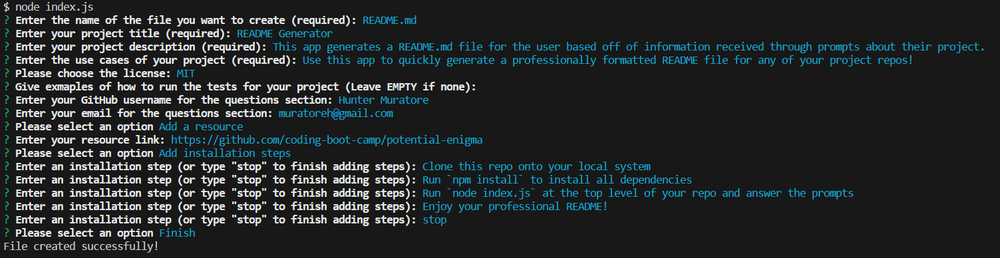

# README Generator

## Description

This app generates a README.md file for the user based off of information received through prompts about their project.

## Table of Contents

- [Description](#description)
- [Installation](#installation)
- [Usage](#usage)
- [License](#license)
- [Contributing](#contributing)
- [Questions](#questions)

## Installation

1. Clone this repo onto your local system

2. Run `npm install` to install all dependencies

3. Run `node index.js` at the top level of your repo and answer the prompts

4. Enjoy your professional README!

## Usage

Use this app to quickly generate a professionally formatted README file for any of your project repos!

## License

This project is under the license of MIT.

## Contributing

Resources:

- [https://github.com/coding-boot-camp/potential-enigma](https://github.com/coding-boot-camp/potential-enigma)

## Questions

GitHub account: [https://github.com/HunterMuratore](https://github.com/HunterMuratore)

Reach me through email here to ask any questions about the app!

>Email: [muratoreh@gmail.com](mailto:muratoreh@gmail.com)
